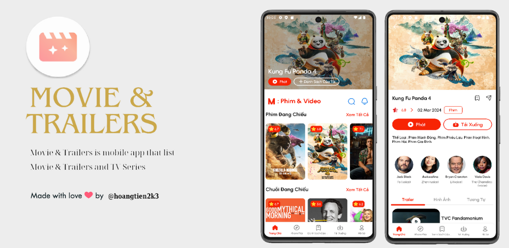
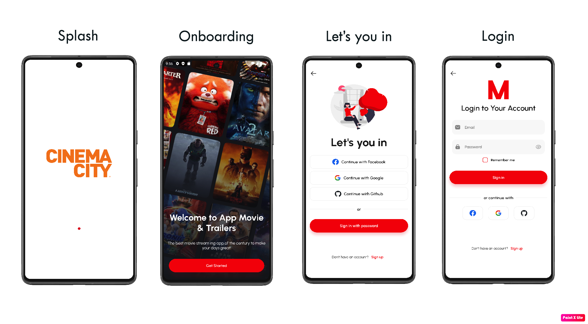
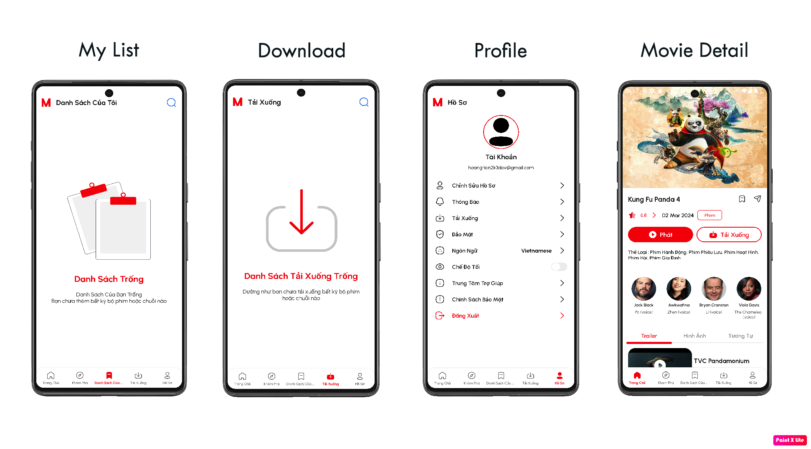
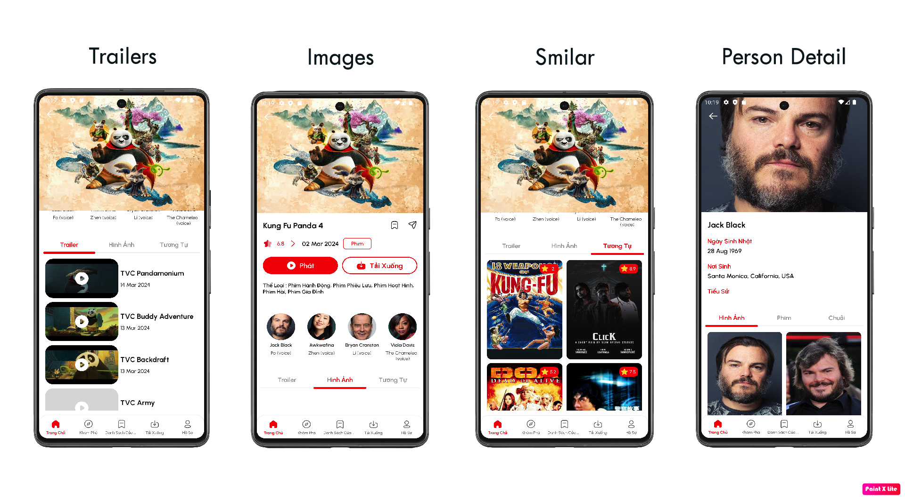
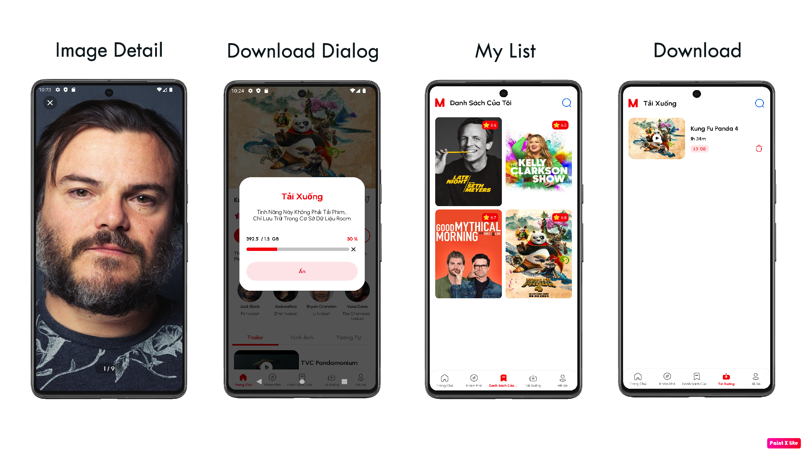
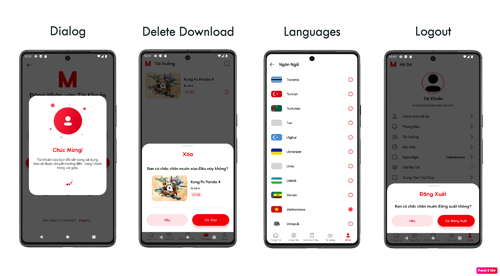

# Movie & Trailers Kotlin Android App

   
`Movie & Trailers` is a TMDb mobile add that list Movie & Trailerss and series, shows their details, you can even watch trailers, save Movie & Trailerss to list for watch later          

## 📎 Releases
***Try latest Mova App APK in Releases Page👇***

***Try latest Mova App in Google Play👇***

## 📷 Screenshots

## 🎨 Design 

 

## ♥ Contributions ✨
Contributions are welcome, use the pull request
 

<!-- ALL-CONTRIBUTORS-LIST:START - Do not remove or modify this section -->
<!-- prettier-ignore-start -->
<!-- markdownlint-disable -->
<table>
  <tr>
    <td align="center"><a href="https://www.linkedin.com/in/hoangtien2k3/"> <b>Hoàng Anh Tiến</b></a> <a href="https://github.com/hoangtien2k3/news-app/commits?author=hoangtien2k3" title="Code">💻</a> <a href="#maintenance-hoangtien2k3" title="Maintenance">🚧</a> <a href="#ideas-hoangtien2k3" title="Ideas, Planning, & Feedback">🤔</a> <a href="#design-hoangtien2k3" title="Design">🎨</a> <a href="https://github.com/hoangtien2k3/news-app/issues?q=author%hoangtien2k3" title="Bug reports">🐛</a></td>
  </tr>
</table>

<!-- markdownlint-restore -->
<!-- prettier-ignore-end -->
<!-- ALL-CONTRIBUTORS-LIST:END -->
