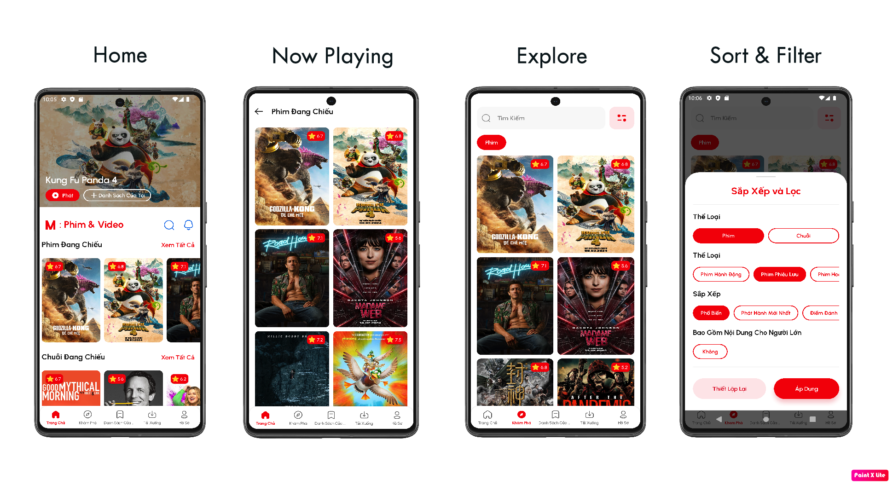

# Mova Kotlin Android App

   
`Movie & Trailers` is a TMDb mobile add that list Movie & Trailerss and series, shows their details, you can even watch trailers, save Movie & Trailerss to list for watch later          

## 📎 Releases
***Try latest Mova App APK in Releases Page👇***

***Try latest Mova App in Google Play👇***

## 🛠 Built With
- [MVVM with Clean Architecture](https://www.toptal.com/android/android-apps-mvvm-with-clean-architecture)
- [Coroutines & Flow](https://developer.android.com/kotlin/flow)
- [Hilt for Dependency Injection](https://developer.android.com/training/dependency-injection/hilt-android)
- [Navigation Component](https://developer.android.com/guide/navigation/navigation-getting-started)
- [Room Database](https://developer.android.com/training/data-storage/room)
- [Firebase Authentication](https://firebase.google.com/docs/auth)
- [Glide](https://github.com/bumptech/glide)
- [Retrofit](https://square.github.io/retrofit)
- [Gson](https://github.com/google/gson)
- [Lottie](https://github.com/LottieFiles/lottie-android)
- [Paging 3](https://proandroiddev.com/paging-3-easier-way-to-pagination-part-1-584cad1f4f61)
- [ViewPager2](https://developer.android.com/jetpack/androidx/releases/viewpager2)
- [Coil](https://coil-kt.github.io/coil/)
- [Youtube Player](https://github.com/PierfrancescoSoffritti/android-youtube-player)
- [TheMovie & TrailersDb(Tmdb) API](https://developers.theMovie & Trailersdb.org/3)

## 📷 Screenshots

## 🎨 Design 

 

## ♥ Contributions ✨
Contributions are welcome, use the pull request
 

<!-- ALL-CONTRIBUTORS-LIST:START - Do not remove or modify this section -->
<!-- prettier-ignore-start -->
<!-- markdownlint-disable -->
<table>
  <tr>
    <td align="center"><a href="https://www.linkedin.com/in/hoangtien2k3/"> <b>Hoàng Anh Tiến</b></a> <a href="https://github.com/hoangtien2k3/news-app/commits?author=hoangtien2k3" title="Code">💻</a> <a href="#maintenance-hoangtien2k3" title="Maintenance">🚧</a> <a href="#ideas-hoangtien2k3" title="Ideas, Planning, & Feedback">🤔</a> <a href="#design-hoangtien2k3" title="Design">🎨</a> <a href="https://github.com/hoangtien2k3/news-app/issues?q=author%hoangtien2k3" title="Bug reports">🐛</a></td>
  </tr>
</table>

<!-- markdownlint-restore -->
<!-- prettier-ignore-end -->
<!-- ALL-CONTRIBUTORS-LIST:END -->